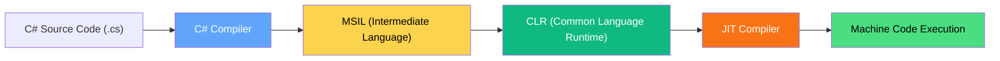
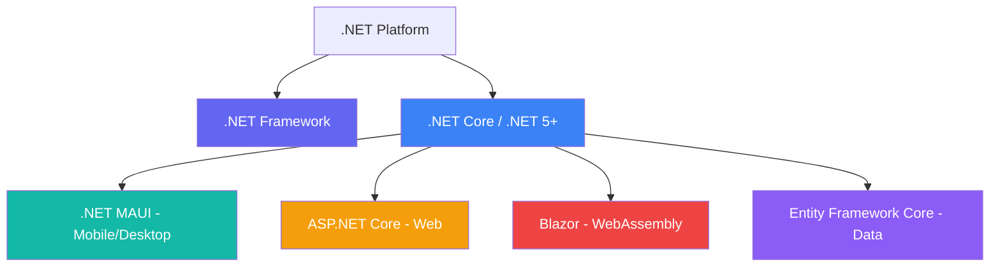

# 🌐 .NET Framework vs .NET Core/5+: A Beginner-Friendly Guide

## 📚 Table of Contents

* [What Is .NET?](#what-is-net)
* [Why It Matters to Microsoft and Modern Apps](#why-it-matters-to-microsoft-and-modern-apps)
* [Difference Between .NET Framework and .NET Core / .NET 5+](#difference-between-net-framework-and-net-core--net-5)
* [Compilation Workflow: From C# to Execution](#compilation-workflow-from-c-to-execution)
* [Mermaid Diagram: Compilation Pipeline](#mermaid-diagram-compilation-pipeline)
* [Mermaid Diagram: .NET Platform Ecosystem](#mermaid-diagram-net-platform-ecosystem)
* [Blazor vs .NET MAUI](#blazor-vs-net-maui)
* [How to Reduce Cloud Costs with .NET 8](#how-to-reduce-cloud-costs-with-net-8)
* [Tech Stack](#tech-stack)
* [Why This Matters for Decision-Makers](#why-this-matters-for-decision-makers)
* [Real-World Scenarios: Blazor vs .NET MAUI](#real-world-scenarios-blazor-vs-net-maui)
* [Cloud Efficiency: .NET 8 vs Node.js](#cloud-efficiency-net-8-vs-nodejs)

---

## 🧠 What Is .NET?

**.NET** is a free, open-source development platform built by Microsoft that lets developers build apps for:

* Web
* Desktop
* Mobile
* Cloud
* Gaming
* IoT

It supports **multiple languages** (like C#, F#, and VB.NET) and runs on Windows, macOS, and Linux.

> If you're writing C# code, you're most likely using some version of the .NET platform to compile and run it.

---

## 🏢 Why It Matters to Microsoft and Modern Apps

.NET is the **backbone of Microsoft’s software ecosystem**, powering:

* Microsoft 365
* Azure Cloud Services
* Visual Studio
* Enterprise apps at Fortune 500 companies

It gives developers:

* A unified platform for web, mobile, and desktop
* Access to modern cloud-native features
* Excellent tooling through Visual Studio and GitHub

> Without .NET, modern Microsoft platforms and services wouldn’t scale, integrate, or evolve at today’s speed.

---

## ⚖️ Difference Between .NET Framework and .NET Core / .NET 5+

| Feature                 | .NET Framework           | .NET Core / .NET 5+            |
| ----------------------- | ------------------------ | ------------------------------ |
| 🛍️ Platform Support    | Windows-only             | Cross-platform (Win/Mac/Linux) |
| 🚀 Performance          | Slower                   | Faster & more scalable         |
| 🛠 Updates              | Legacy (minimal updates) | Actively updated               |
| 🧩 App Types Supported  | Web, Desktop (WinForms)  | Web, Desktop, Mobile, Cloud    |
| 🔗 Open Source          | No                       | Yes                            |
| 🧱 Modular Architecture | Monolithic               | Modular                        |

> .NET Core was renamed to ".NET 5+" starting in 2020 as part of Microsoft's unification plan.

---

## 🔄 Compilation Workflow: From C# to Execution

When you write a C# program, it goes through a special process before it runs:

1. **C# Source Code (.cs)**  → Written by the developer
2. **Compiler (csc.exe)**  → Translates your code to MSIL (Microsoft Intermediate Language)
3. **MSIL**  → A CPU-independent set of instructions
4. **CLR (Common Language Runtime)** → Converts MSIL to native machine code using:

   * **JIT (Just-In-Time Compiler)** at runtime
5. **App Runs on Your Device**

---

## 🧪 Mermaid Diagram: Compilation Pipeline

---

## 🧭 Mermaid Diagram: .NET Platform Ecosystem

---

## 🧪 Real-World Scenarios: Blazor vs .NET MAUI

### Blazor Use Cases:

* A healthcare dashboard for doctors that runs in a browser with secure authentication
* A real-time internal tool for customer support agents at a telecom company
* A reporting system in a logistics firm where users need dynamic charts but no mobile app

### .NET MAUI Use Cases:

* A cross-platform field inspection app for a construction company used on iPads and Windows laptops
* A retail store inventory scanner app for Android and iOS
* A native desktop scheduling app for salons that works offline and syncs later

> If your users are mobile-first or need offline features, choose .NET MAUI. If your users live in the browser and need fast deployment, choose Blazor.

---

## ☁️ Cloud Efficiency: .NET 8 vs Node.js

| Feature                      | .NET 8                                  | Node.js                          |
| ---------------------------- | --------------------------------------- | -------------------------------- |
| 🧠 Runtime                   | Compiled (AOT/JIT)                      | Interpreted                      |
| 🚀 Cold Start Performance    | Faster with AOT in serverless           | Slower unless pre-warmed         |
| 📦 Container Size            | Slim SDK + native trimming              | Generally larger + includes Node |
| 🔋 Memory Efficiency         | High — due to GC and span<T>            | Moderate — event-loop based      |
| ☁️ Cloud-native Optimization | Built-in support (Azure Functions, etc) | Works but requires tuning        |
| 🛠 Tooling                   | Enterprise-grade (Visual Studio, Azure) | Lightweight (npm, VS Code)       |

> For cloud-native apps needing fast startup, strong type safety, and high performance at scale — .NET 8 delivers better long-term value. Node.js shines in lightweight, rapid prototypes or low-scale services.

---

